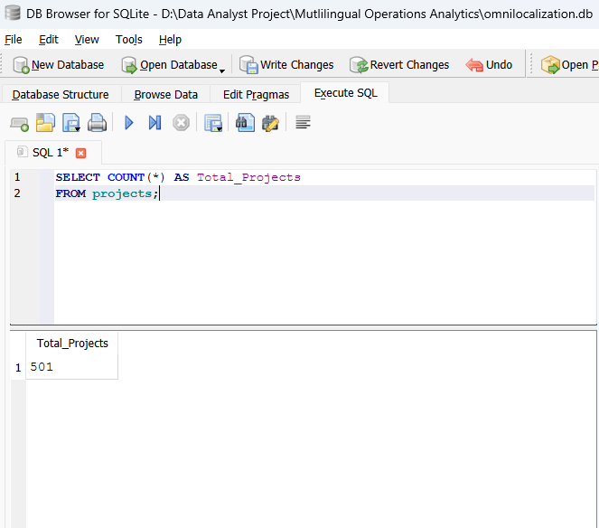
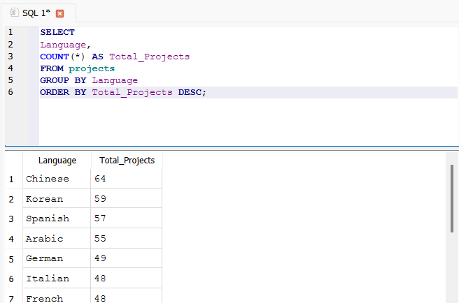
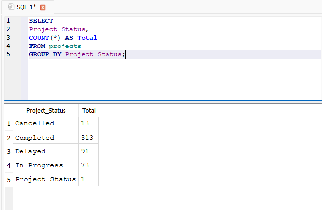
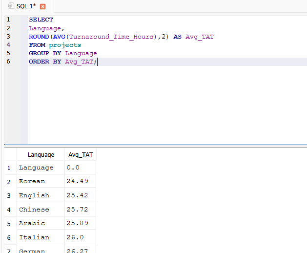
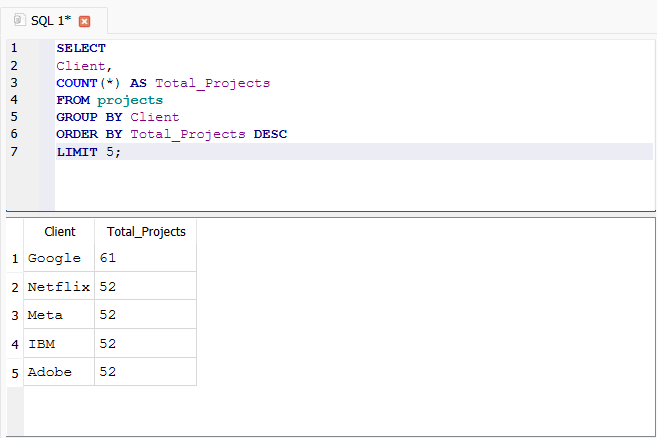

# SQL Analytics

## Objective
Analyze multilingual translation operations data using SQL to generate business insights.

## Key SQL Analysis

- Total Projects Analysis
- Language-wise Project Distribution
- Project Status Analysis
- Average Turnaround Time
- Top Clients by Project Volume

## Sample Queries

```sql
SELECT COUNT(*) AS Total_Projects
FROM projects;
```

```sql
SELECT Language, COUNT(*) AS Total_Projects
FROM projects
GROUP BY Language
ORDER BY Total_Projects DESC;
```

## SQL Screenshots










