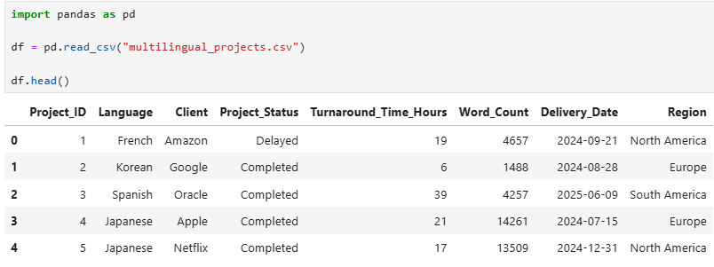
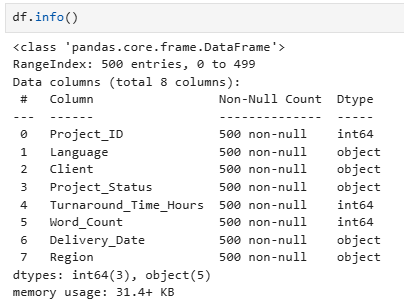
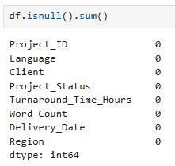
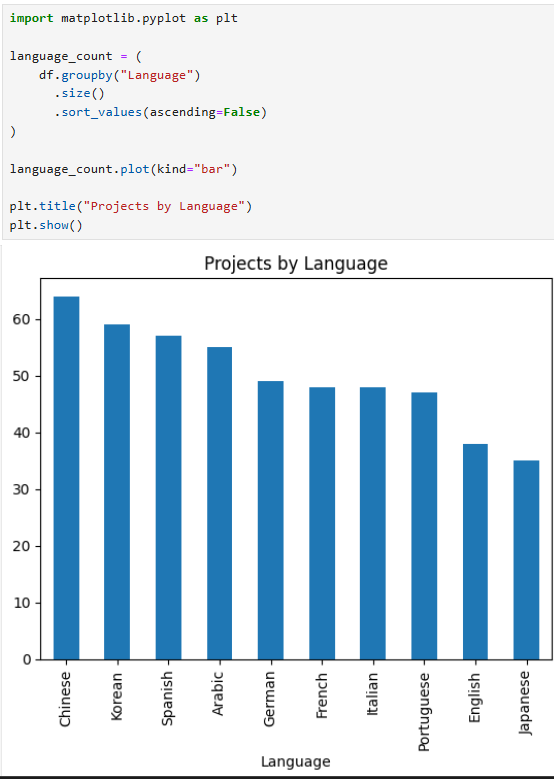
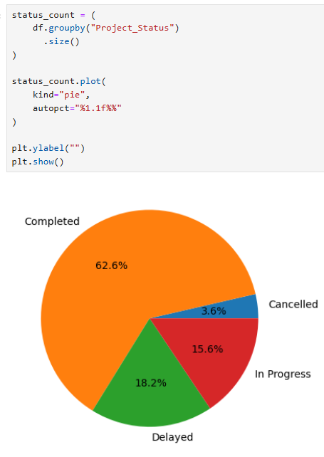

# Python Exploratory Data Analysis (EDA)

## Tools Used

- Python
- Pandas
- NumPy
- Matplotlib
- Seaborn

## Analysis Performed

- Dataset Inspection
- Data Cleaning
- Missing Value Analysis
- Language Distribution Analysis
- Project Status Analysis

## Screenshots

